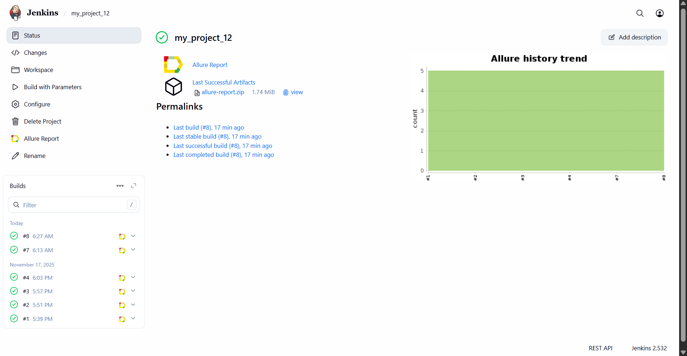
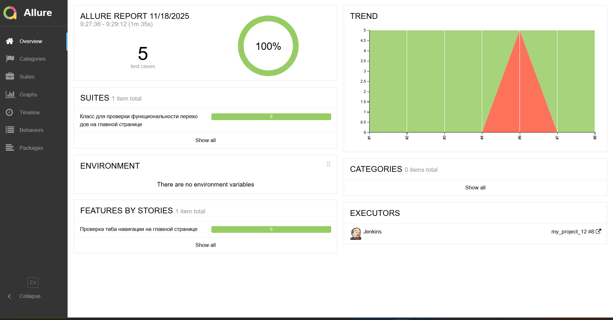
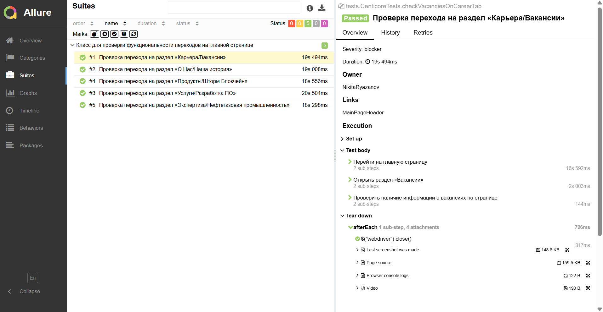
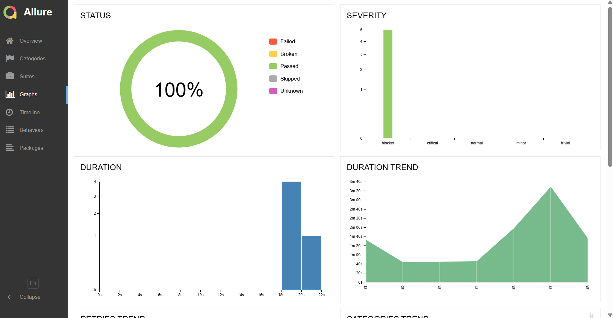
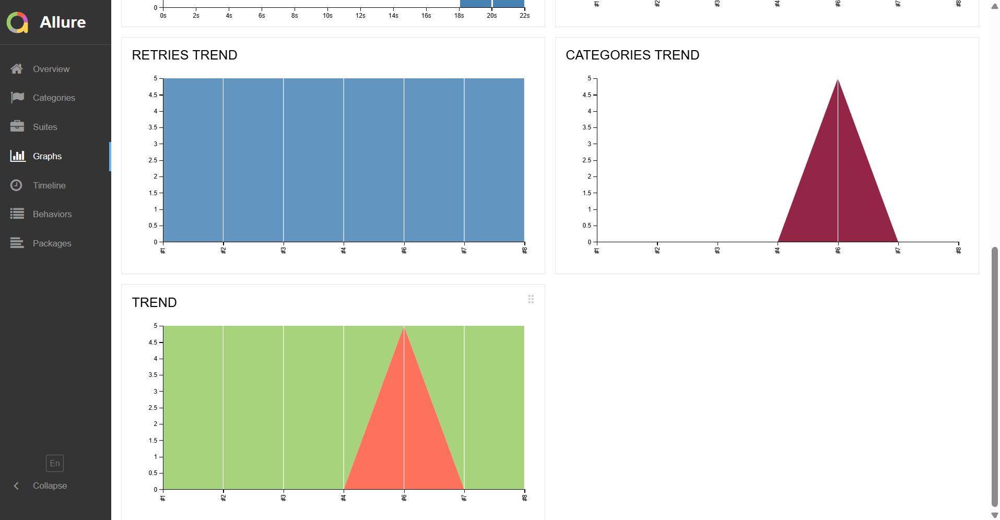
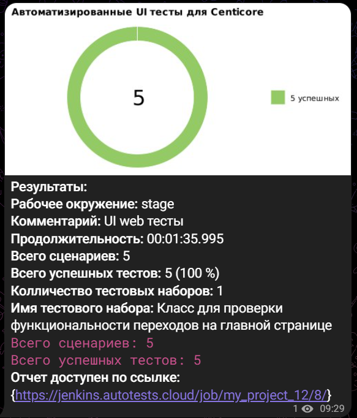
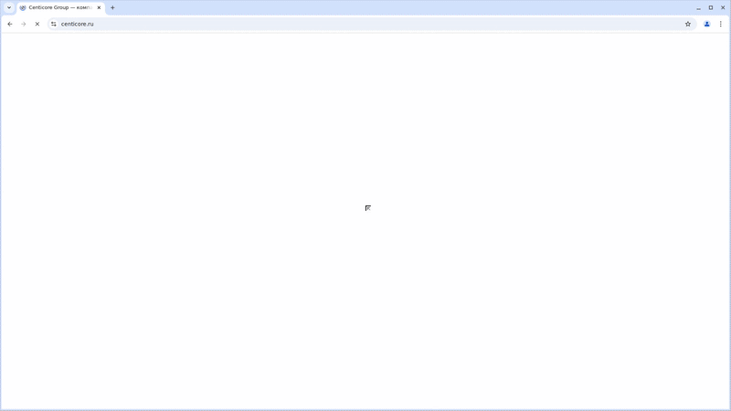

## <a href="https://escape-room-neon.vercel.app/"></a>
# Проект по автоматизации тестирования для компании [Centicore](https://centicore.ru/)

* Проект Escape Room — ученический проект по фронтенд-разработке от HTML-Академии.
* [Репозиторий с проектом](https://github.com/JulianaAstra/Escape_Room)

## **Содержание:**
____

* <a href="#tools">Технологии и инструменты</a>

* <a href="#cases">Примеры автоматизированных тест-кейсов</a>

* <a href="#jenkins">Сборка в Jenkins</a>

* <a href="#console">Запуск из терминала</a>

* <a href="#allure">Allure отчет</a>

* <a href="#telegram">Уведомление в Telegram при помощи бота</a>

* <a href="#video">Примеры видео выполнения тестов на Selenoid</a>
____
<a id="tools"></a>
## <a name="Технологии и инструменты">**Технологии и инструменты:**</a>

<p align="center">  
<a href="https://www.java.com/"></a>  
<a href="https://github.com/"></a>  
<a href="https://junit.org/junit5/"></a>  
<a href="https://gradle.org/"></a>  
<a href="https://selenide.org/"></a>  
<a href="https://aerokube.com/selenoid/"></a>  
<a href="https://allurereport.org/"></a>  
<a href="https://www.jenkins.io/"></a>   
</p>

____
<a id="cases"></a>
## <a name="Примеры автоматизированных тест-кейсов">**Примеры автоматизированных тест-кейсов:**</a>
____
- ✓ *Проверка перехода на раздел «Карьера/Вакансии»*
- ✓ *Проверка перехода на раздел «О Нас/Наша история»*
- ✓ *Проверка перехода на раздел «Продукты/Шторм Блокчейн»*
- ✓ *Проверка перехода на раздел «Услуги/Разработка ПО»*
- ✓ *Проверка перехода на раздел «Экспертиза/Нефтегазовая промышленность»*

____
<a id="jenkins"></a>
## </a><a name="Сборка"></a>Сборка в [Jenkins](https://jenkins.autotests.cloud/job/037-sandraboticelli-escaperoom-12/)</a>
____
<p align="center">  
<a href="https://jenkins.autotests.cloud/job/037-sandraboticelli-escaperoom-12/"></a>  
</p>


### **Параметры сборки в Jenkins:**

- *browser (браузер, по умолчанию chrome)*
- *version (версия браузера, по умолчанию 128)*
- *windowSize (размер окна браузера, по умолчанию 1920x1080)*
- *baseUrl (адрес тестируемого веб-сайта)*
- *remoteHost (адрес удаленного сервера Selenoid)*

<a id="console"></a>
### Команды для запуска из терминала
___
***Локальный запуск всех тестов:***
```bash  
./gradlew clean test
```

***Удалённый запуск через Jenkins:***
```bash  
clean test
-Dbrowser=${browser}
-DbrowserVersion=${browserVersion}
-DbrowserSize=${browserSize}
-DremoteHost=${remoteHost}
```
___
<a id="allure"></a>
## </a> <a name="Allure"></a>Allure [отчет](https://jenkins.autotests.cloud/job/037-sandraboticelli-escaperoom-12/allure/)</a>
___

### *Основная страница отчёта*

<p align="center">  
  
</p>  

### *Тест-кейсы*

<p align="center">  
  
</p>

### *Графики*

  <p align="center">  


  
</p>

____
<a id="telegram"></a>
## </a> Уведомление в Telegram при помощи бота
____
<p align="center">  
  
</p>

____
<a id="video"></a>
## </a> Пример видео выполнения тестов на Selenoid
____
<p align="center">
   
</p>